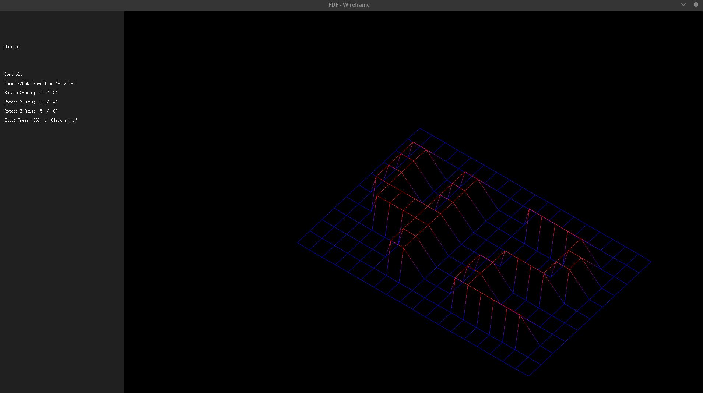

# 🧭 FdF — Wireframe Viewer

**FdF** (Fil de Fer) is a simplified 3D wireframe viewer written in C. It takes a map file with elevation data and displays a 3D projection using MiniLibX, offering zoom, rotation, color gradients, and an interactive UI.


---

## 📄 Table of Contents

* [Overview](#-overview)
* [Features](#-features)
* [Installation](#-installation)
* [Usage](#-usage)
* [Controls](#-controls)
* [File Format](#-file-format)
* [Code Structure](#-code-structure)
* [Dependencies](#-dependencies)
* [Screenshots](#-screenshots)
* [Author](#-author)

---

## 🧠 Overview

The goal of the project is to read a file representing 3D coordinates and render it in a 2D window using isometric projection and the MiniLibX library. The application includes a graphical sidebar, zooming, rotation, and color transitions based on elevation.

---

## ✨ Features

* ✅ 3D wireframe rendering using isometric projection
* ✅ Color gradients based on elevation (`z`)
* ✅ Interactive UI: zoom, rotate (x/y/z), move map
* ✅ Graphical sidebar with helpful information
* ✅ Memory-safe with proper resource cleanup
* ✅ Includes custom libft and clean Makefile

---

## ⚙️ Installation

```bash
git clone https://github.com/yourusername/fdf_wireframe.git
cd fdf_wireframe
make
```

Make sure you are on a Linux system with X11 and required libraries installed. You may need:

```bash
sudo apt install libx11-dev libxext-dev
```

---

## 🚀 Usage

```bash
./fdf <map_file.fdf>
```

Example:

```bash
./fdf maps/42.fdf
```

---

## 🎮 Controls

| Key          | Action                      |
| ------------ | --------------------------- |
| `ESC`        | Exit program                |
| `+ / -`      | Zoom in/out                 |
| `Arrow keys` | Move map up/down/left/right |
| `Q/E`        | Rotate around X-axis        |
| `A/D`        | Rotate around Y-axis        |
| `Z/C`        | Rotate around Z-axis        |

---

## 🗺️ File Format

Each `.fdf` map file contains lines of space-separated integers representing elevations. Optionally, a hexadecimal color code can be attached:

```
0  0  0  0
0  5  5  0
0  5,0xFF0000  5  0
```

* **Height values** = `z` coordinates
* **Colors (optional)** = custom color for each point

---

## 🧱 Code Structure

```bash
.
├── srcs/
│   ├── main.c               # Entry point
│   ├── draw.c               # Drawing and rendering logic
│   ├── map_init.c           # Load and parse map
│   ├── validate.c           # Input validation
│   ├── key_events.c         # Keyboard input handler
│   ├── draw_sidebar.c       # Sidebar rendering
│   ├── color.c              # Gradient and color logic
│   └── ...                  # Other utilities
├── inc/
│   ├── fdf.h                # Main project header
│   └── keybindings.h        # Keycode definitions
├── libft/                   # Custom standard library
├── resources/minilibx-linux # MiniLibX source
└── Makefile
```

---

## 📦 Dependencies

* [MiniLibX](https://harm-smits.github.io/42docs/libs/minilibx) (Linux version)
* libX11, libXext, math.h
* Custom [libft](https://github.com/josedorazio/libft)

---

